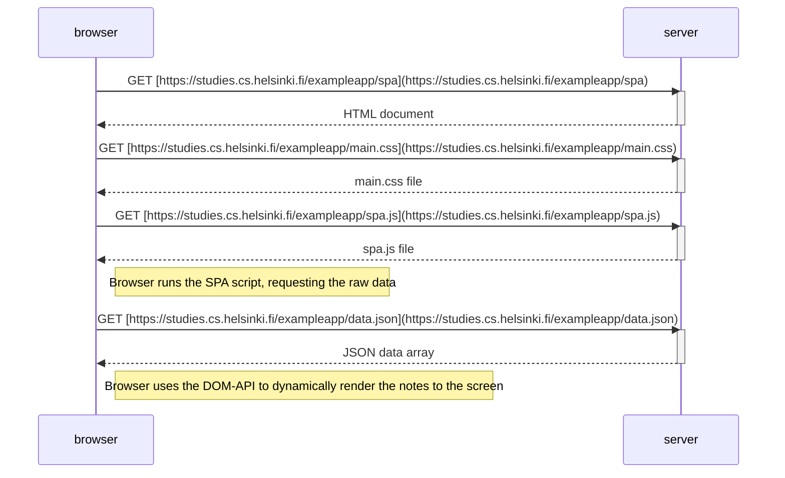

````markdown

```mermaid
sequenceDiagram
    participant browser
    participant server

    browser->>server: GET [https://studies.cs.helsinki.fi/exampleapp/spa](https://studies.cs.helsinki.fi/exampleapp/spa)
    activate server
    server-->>browser: HTML document
    deactivate server

    browser->>server: GET [https://studies.cs.helsinki.fi/exampleapp/main.css](https://studies.cs.helsinki.fi/exampleapp/main.css)
    activate server
    server-->>browser: main.css file
    deactivate server

    browser->>server: GET [https://studies.cs.helsinki.fi/exampleapp/spa.js](https://studies.cs.helsinki.fi/exampleapp/spa.js)
    activate server
    server-->>browser: spa.js file
    deactivate server

    Note right of browser: Browser runs the SPA script, requesting the raw data

    browser->>server: GET [https://studies.cs.helsinki.fi/exampleapp/data.json](https://studies.cs.helsinki.fi/exampleapp/data.json)
    activate server
    server-->>browser: JSON data array
    deactivate server

    Note right of browser: Browser uses the DOM-API to dynamically render the notes to the screen
```
````
