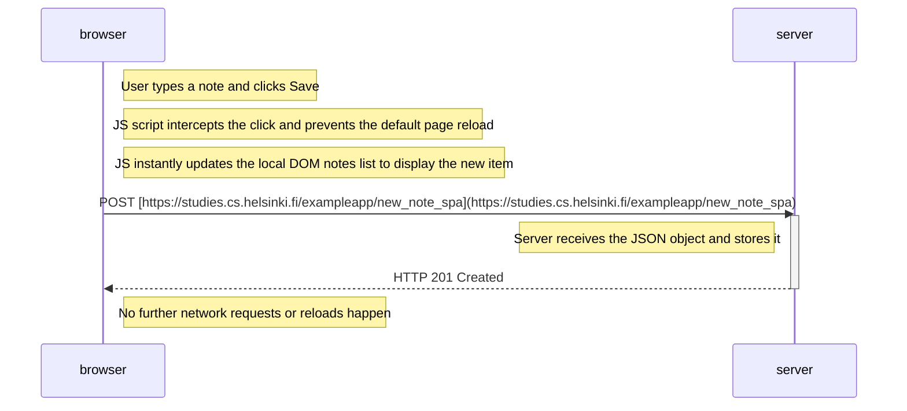

````markdown

```mermaid
sequenceDiagram
    participant browser
    participant server

    Note right of browser: User types a note and clicks Save
    Note right of browser: JS script intercepts the click and prevents the default page reload
    Note right of browser: JS instantly updates the local DOM notes list to display the new item

    browser->>server: POST [https://studies.cs.helsinki.fi/exampleapp/new_note_spa](https://studies.cs.helsinki.fi/exampleapp/new_note_spa)
    activate server
    Note left of server: Server receives the JSON object and stores it
    server-->>browser: HTTP 201 Created
    deactivate server

    Note right of browser: No further network requests or reloads happen
```
````
